# JVM구조, SevletContainer, SpringContainer, IoC, DI에 대해서

> Inversion of Controll, Dependency Injection 을 공부하면서, 컨테이너가 무엇인지에
> 대한 궁금증이 생겼으며, [Sigrid Jin' Medium - ServletContainer와 SpringContainer는 무엇이 다른가?
](https://jypthemiracle.medium.com/servletcontainer%EC%99%80-springcontainer%EB%8A%94-%EB%AC%B4%EC%97%87%EC%9D%B4-%EB%8B%A4%EB%A5%B8%EA%B0%80-626d27a80fe5)
> 라는 글을 참고하여 정리


## 1. 자바의 메모리 구조

<p align="center">
<<<<<<< HEAD
  
=======
  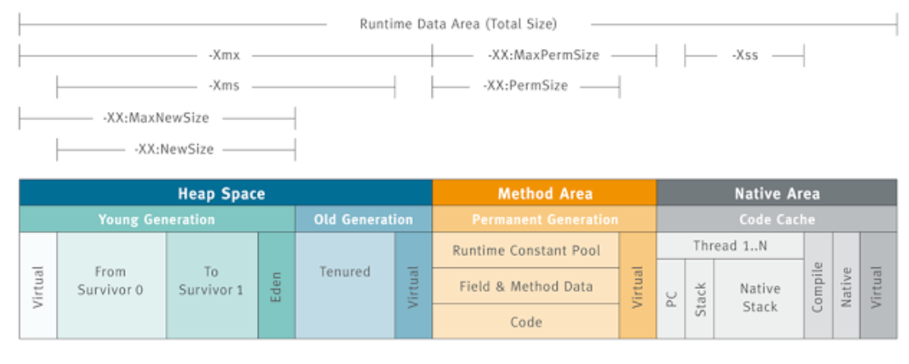
>>>>>>> main
</p>

- JVM은 실행하기 위해서, OS로부터 메모리를 할당 받고, 이것을 나누어 관리한다.
- OS로 부터 받은 메모리 공간을 `Runtime Data Area`라고 하며 JVM은 이 영역을 5개로 나누어 관리한다.
- 용도에 맞게 다음과 같이 다섯개로 나눈다.
  - Class Area(Method Area)
  - Stack Area
  - Heap Area
  - Native Method Stack Area

- 크게는 Class Area, Stack Area, Heap Area로 분류한다.
- PC Register, JVM stack, Native Method stack은 Thread 별로 생성, Heap과 Class Area는
모든 Thread가 공유한다.

**Class Area :**

> 자바 바이트 코드(Java bytecode)란 자바 가상 머신이 이해할 수 있는 언어로 변환된 자바 소스 코드를 의미한다.

- 클래스 파일의 바이트 코드가 로드되는 공간이다.
- JVM이 무언가 실행하려면 바이트 코드들이 메모리 공간이 있어야 한다.
- JVM은 메인 메소드를 호출하는 것으로 시작한다.
- 메인메소드에서 사용하는 클래스와 static 변수들이 Class Area(메서드 영역)에 올라온다.
- 즉, Class Area에 로드되는 바이트코드는 프로그램 흐름을 구성하는 바이트코드이다.
- 사실상 전체 바이트코드가 이 영역에 올라간다.
- Class Area에 바이트코드가 로드되는 것을 클래스 로딩이라고 한다.
  - 클래스를 사용하는 시점에 해당 클래스의 바이트코드가 들어있는 파일을 찾아서 메모리에 로딩하는 것을 의미

**JVM 클래스 로딩 절차 :**

- 어떤 메소드를 호출하는 문장을 만났다.
- 그 메소드를 가진 클래스 바이트코드가 아직 로딩된 적이 없다면, JVM은 JRE 라이브러리 폴더에서 클래스를 찾는다.
- 없다면, CLASSPATH 환경변수에 지정된 폴더에서 클래스를 찾는다.
- 찾았다면, 그 클래스 파일에 대해 바이트코드를 검증한다.
- 올바른 바이트코드라면 Class Area로 로딩한다.
- 클래스 변수를 만들라는 명령어가 있다면 Class Area에 그 변수를 준비한다.
- 클래스 블록이 있따면 순서대로 그 블록을 실행한다.
- 이렇게 한번 클래스의 바이트코드가 로딩되면 JVM이 종료될 때까지 유지된다.

---

**Stack Area :**

> 지역변수는 메소드 내에서 선언된 변수, 매개변수는 메소드의 arguments로 넘겨주는 값들로 이해하면 된다.

- 지역변수와 매개변수가 저장되는 공간이다.
- 로컬변수와 매개변수의 특징은 선언된 블록에서만 유효한 값이라는 것이다.
- Stack Area에서는 프로그램의 실행과정에서 임시로 할당되고, 그게 끝나면 소멸되는 것들이 저장된다.

---
**Heap Area :**

- Heap Area에는 흔히 코드에서 new 명령을 통해 생성된 인스턴스 변수가 놓인다.
- 어떤 메소드인지는 상관없이, new 명령으로 만드는 메모리는 힙 영역에 보관된다.
- 힙 영역에 보관되는 메모리는 메서드 호출이 끝나도 사라지지 않고 유지된다.
  - 주소를 잃어버려 가비지 컬렉터에 의해서 지워질 때까지, 혹은 JVM이 종료될 떄 까지 유지

- 인스턴스를 별도의 힙 영역에 할당하는 이유는 인스턴스의 소멸방법과 소멸시점이 지역변수와는 다르기 때문이다.

> 8가지 원시타입(byte, short, long, int, float,double, char, boolean)을 제외한 나머지는 레퍼런스 변수이다.
> 레퍼런스 변수는 실행될 때마다 많은 데이터들을 스택메모리 영역에 뒀다 뺏다 하는게 비효율적이므로, 힙 영역에 그 내용이 저장되고, 스택 영역에는 간단하게 그 주소만 저장된다.
> 힙 영역에는 실제 그 변수가 가리키고 있는 값들이 저장되어 있다.

---

## 2. IoC와 DI

- `제어의 역전(Inversion of Control)` : 제어 반전, 제어의 반전, 역제어는 프로그래머가 작성한 프로그램이 재사용 라이브러리의 흐름 제어를 받게 되는 소프트웨어 디자인 패턴을 말한다. 줄여서 IoC(Inversion of Control)이라고 부른다.
- `의존성 주입(dependency injection)` : 소프트웨어 엔지니어링에서 의존성 주입(dependency injection)은 하나의 객체가 다른 객체의 의존성을 제공하는 테크닉이다.
  -  `의존성`은 예를 들어 서비스로 사용할 수 있는 객체이다. 클라이언트가 어떤 서비스를 사용할 것인지 지정하는 대신, 클라이언트에게 무슨 서비스를 사용할 것인지를 말해주는 것이다.
  - `주입`은 의존성(서비스)을 사용하려는 객체(클라이언트)로 전달하는 것을 의미한다.
  - 의존성 주입의 의도는 객체의 생성과 사용의 관심을 분리하는 것이다. 이는 가독성과 코드 재사용을 높혀준다.
  - 의존성 주입은 프로그램 디자인이 결합도를 느슨하게 되도록하고 의존관계 역전 원칙과 단일 책임 원칙을 따르도록 클라이언트의 생성에 대한 의존성을 클라이언트의 행위로부터 분리하는 것이다.

> IoC는 DI보다 일반적이다. IoC는 호출을 요구하는 대신 다른 코드가 호출할 수 있게 함을 의미한다.
> DI가 없는 IoC의 한 예시로 템플릿 메소드 패턴이 있다. 여기서 다형성은  서브클래싱, 즉 상속을 통해 달성한다.


## 3. Controller 1개가 수십 만개의 요청을 처리하는 방법

- Tomcat은 기본 worker thread가 200개로 설정되어있다.
  - > By default, tomcat sets `maxThread` to 200.

- Tomcat은 하나의 프로세스에서 동작하고, Thread pool(하늘 github 운영체제 정리한 글 참고)을 만든다.
- HttpRequest가 들어오면, 하나씩 쓰레드를 재사용 및 재배정을 진행한다.
- 쓰레드 풀에 생성될 수 있는 쓰레드 개수의 max를 직접 지정할 수 있다. 실질적으로는 유휴한 상태로 남겨지는 쓰레드의 최소 개수도 있다. 요청이 많아지면, 그에 따라 실질적으로 큐에 쌓였다가 쓰레드가 만들어지는 등 일반적인 쓰레드 풀의 동작을 한다.

> 요청 별로 쓰레드가 생성되고, 이에 따라 각각의 ServletContext를 갖는 것은 분명한데, 어떻게 Controller 객체를 공유할 수 있는가?

- Controller 객체 하나를 생성하면 객체 자체는 Heap에 생성된다.
- 하지만 Class의 정보는 Class Area에 저장된다.
- 결국 힙 영역이던 클래스 영역이던 모든 쓰레드가 객체의 Binary Code 정보를 공유할 수 있다.
- 공유되는 정보를 사용하기 위하여 굳이 Controller 객체를 사용하고 있는 쓰레드나 Controller 객체 자체가 Block 될 필요는 없다.
- 내부적으로 상태를 갖는 것이 없으니, 내부의 상태를 변경할 일이 없고 그저 메소드에 대한 정보만 ‘같이 공유해서’ 쓰면 되는 것이기 때문에 동기화에 대한 걱정을 할 필요가 없다.

<<<<<<< HEAD
- 만약 상태를 가지는 Bean을 만들어야 한다면, scope를 prototype으로 지정해야할 것이다.
  - 하지만 그러한 경우는 거의 보지 못했다.
  - 설상 stateful해야 한다해도, DI를 활용하여 외부에서 하위 개체를 주입한다면 굳이 singleton을 쓰지 않을 이유가 없다.
  - DI를 사용하는 것이 훨씬 유지보수에 좋을 수 있다.

- spring bean을 만들 때는 stateless하게 만들어야한다. 왜냐하면, bean이 상태를 갖게 되었을 경우, 그 상태를 공유하는 모든 쓰레드들로 부터 안전할 수 있게 동기화를 해줘야 하고, 동기화를 하는 순간 싱글톤으로써의 혜택이 날아간다고 봐야한다.
  - 싱글톤으로 빈을 관리하는 이유는 대규모 트래픽을 처리할 수 있도록 하기 위함이다.

**ServletContext란? :**
> 서블릿 컨텍스트(ServletContext)란 하나의 서블릿이 서블릿 컨테이너와 통신하기 위해서 사용되어지는 메서드들을 가지고 있는 클래스가 바로 ServletContext다


## 4. 서블릿 컨테이너와 스프링 컨테이너의 차이

**Servlet이란 :**

- Servlet은 Java EE의 표준이며, javax.servlet Package를 기반으로 Server에서 동작하는 Class 들을 의미한다.
- 각 Servlet은 init(), service(), destroy() 3개의 method를 정의해야 한다.
  - `init()` : init()은 Servlet 생성시 호출된다. Parameter로 javax.servlet.ServletConfig Interface 기반의 Instance가 넘어오는데, Servlet을 초기화 하고 Servlet이 이용하는 자원을 할당하는 동작을 수행한다.
  - `service()` : Servlet으로 요청이 전달 될때마다 호출된다. 실제 Service Logic을 수행한다.
  - `destroy()` : Servlet이 삭제될때 호출된다. Servlet에서 이용하는 자원을 해지하는 동작을 수행한다.

---

**웹 서버 측면에서 서블릿 :**

- Container는 Socket의 생성과 I/O Stream의 생성 등의 업무를 개발자를 대신해서 진행해준다.
- Container는 Servlet의 생명주기(life-cycle)을 관리하고, 매번 요청이 들어올 떄, 새로운 쓰레드를 요청 별로 부여한다.
  - > 컨테이너는 단일 서블릿에 대한 여러 요청을 처리하기 위해 여러 스레드를 실행합니다(하나의 프로세스에서)


```java
public class MyServlet extends HttpServlet {
    private Object thisIsNOTThreadSafe;
    protected void doGet(HttpServletRequest request, HttpServletResponse response) throws ServletException, IOException {
    Object thisIsThreadSafe;
  }
}
```

<p align="center">
  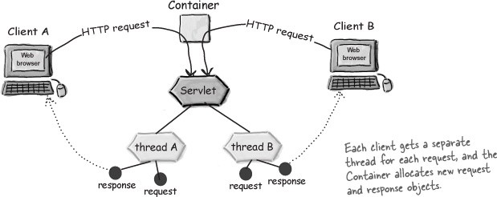
</p>


- 요청 당 하나의 쓰레드다. Contrainer는 누가 요청을 보냈는지에 대해서 관심이 없으며, 새로운 요청은 새로운 쓰레드를 만들어 낸다.
- Thread-per-request를 Thread-per-connection보다 우선시 사용하는 이유
  - 확장성에 유리하다.
    - Java의 쓰레드 비용은 비싸다.
    - 커넥션 하나에 쓰레드를  붙이면, 쓰레드는 요청이 계속 오기까지 idle 상태로 대기해야 한다.
    - 궁극적으로 프레임워크는 새로운 커넥션을 만들지 못하게 되거나, 기존 커넥션을 끊을 것이다.
    - 즉, 커넥션이 연결되는 동안 쓰레드가 유지되어야 하는 것이 문제가 된다.
    - 반면, Thread-per-request는 request가 진행될 때만 쓰레드가 개입을 하니까 서비스는 수만명이 사용해도 요청에만 쓰레드를 투입시키기 때문에 경제적임

- 다만, 클라이언트가 지속적으로 요청을 날려야 하는 상황에서는 HTTP Keep-alives를 사용하여 Connection 별로 Thread를 지속적으로 유지하도록 할 수 있다.

---

**ServletContainer란 :**

<p align="center">
  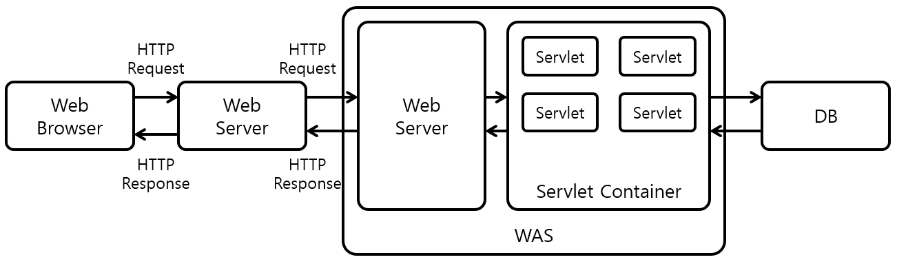
</p>

> Servlet Container(Web Container)는 Servlet Instance를 생성하고 관리하는 역할을 수행한다. HTTP 요청을 도식화하면 다음과 같다.

1. Web Browser에서 Web Server에 HTTP Request를 보내면, Web Server는 받은 HTTP 요청을 WAS Server의 Web Server에 전달한다.
2. WAS Server의 Web Server는 HTTP 요청을 Servlet Container에 전달한다.
3. Servlet Container는 HTTP 요청 처리에 필요한 서블릿 인스턴스가 힙 메모리 영역에 있는 지 확인한다. 존재하지 않는다면, Servlet Instance를 생성하고 해당 Servlet Instance의 init() method를 호출하여 Servlet Instance를 초기화한다.
4. Servlet Container는 Servlet Instance의 service() 메소드를 호출하여 HTTP 요청을 처리하고, WAS Server의 Web Server에게 처리 결과를 전달한다.
5. WAS Server의 Web Server는 HTTP 응답을 Web Server에게 전달하고, Web Server는 받은 HTTP 응답을 Web Browser에 전달한다.


> 대표적으로 알고 있는 ServletContainer는 Tomcat이다. ServletContainer는 하나의 WebApplication에 붙는다. Tomcat도 결국 Java 프로그램이기 때문에, one WAS per one JVM이다.

<p align="center">
  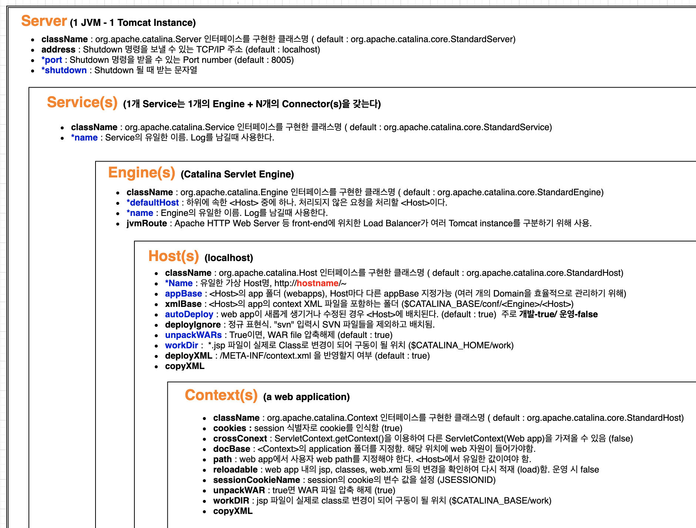 <br>
  <a> [톰캣 구조](https://velog.io/@hyunjae-lee/Tomcat-2-%EA%B5%AC%EC%A1%B0) </a>
</p>

- Application이 시작되면 Servlet Listener는 사전에 지정된 역할을 수행하며, Servlet을 생성하거나 제거하는 역할을 수행한다. 
- 서블릿 API는 Servlet과 ServletConfig 인터페이스를 구현해 제공되는데, GenericServlet 추상클래스가 위 두 인터페이스의 추상 메서드를 구현하고 HttpServlet이 GenericServlet을 상속받는다. 여기서 doPost와 doGet의 메소드가 나온다.

---


**JVM이 Servlet을 실행하는 것과, 일반 자바 클래스를 실행 차이 :**

- JVM에서의 호출 방식은 서블릿과 일반 클래스 모두 같다.
- 서블릿은 main() 함수로 직접 호출되지 않는다는 차이가 있다. 서블릿은 Tomcat 같은 Web Container에 의해 실행되는 것이다. Container가 web.xml을 읽고 서블릿 클래스를 class loader에 등록하는 절차를 밟는다.

<p align="center">
  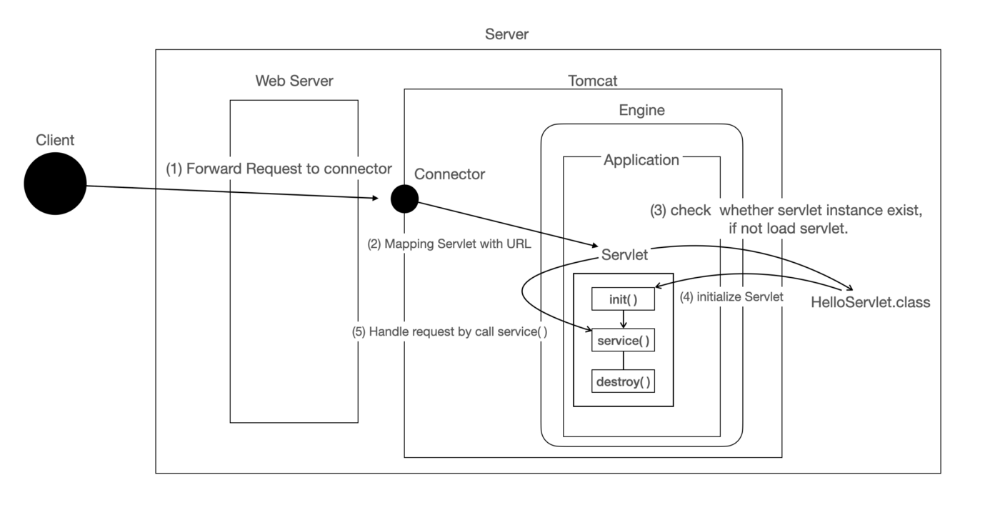
</p>

- HttpRequest가 Servlet Container로 새로이 들어오면 Servlet Container는 HttpServletRequest, HttpServletResponse 두 객체를 생성한다.
- GET/POST 여부에 따라 doGet() 이나 doPost()를 실행하게 되며, 동적 페이지 생성 후, HttpServletResponse 객체에 응답을 보낸다.
- 이 때, 각각의 Servlet 클래스는 JVM의 Class Loader에 의해 로딩된다. 
- Java Servlet container는 서블릿 생성자를 호출하고, 각각의 서블릿 생성자는 어떠한 매개변수도 받지 않는다.

- HTTP 요청 처리 과정을 보면 Servlet Instance는 HTTP 요청이 올 때마다 기존의 Servlet Instance를 이용한다.
- 즉, 하나의 Servlet Instance가 여러개의 HTTP 요청을 동시에 처리하게 된다. 
- 따라서 Servlet Instance는 `Thread-Safe`하지 않다. 
- Thread-Safe한 변수를 이용하기 위해서는 Method의 지역변수를 이용해야 한다.
- Servlet Container는 사용되지 않아 제거되야할 Servlet Instance의 destory() method를 호출하고 JVM의 GC(Garbage Collector)에서 Servlet Instance를 해지할 수 있도록 표시해둔다. 
- GC는 표시된 Servlet Instance를 해지한다.

---

**Spring Container는 어떻게 생성되는가 :**

<p align="center">
  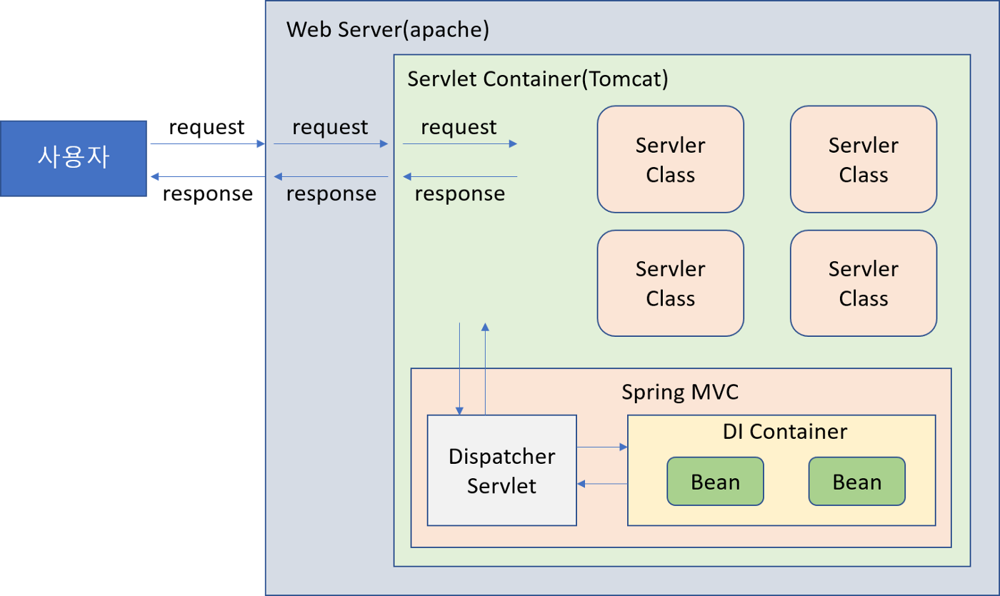
</p>

<p align="center">
  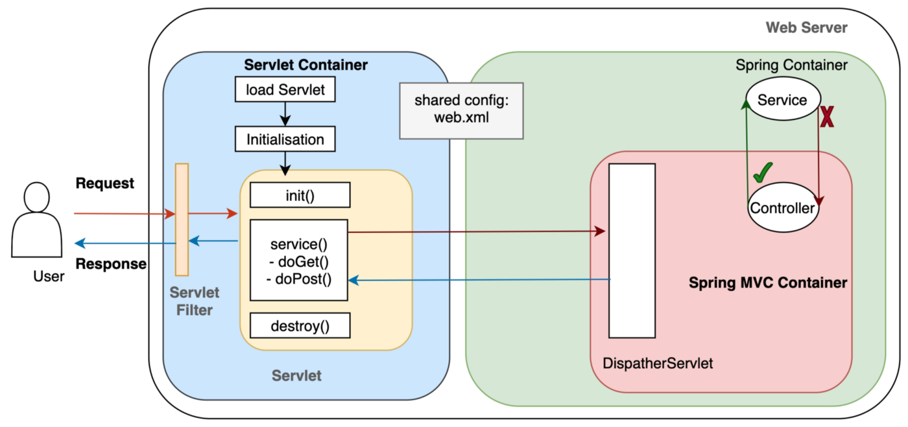
</p>

> Spring Container는 Bean 생명주기를 관리한다. Bean을 관리하기 위해 IoC가 이용된다. Spring Container에는 BeanFactory가 있고, 
> ApplicationContext는 이를 상속한다. 이 두 개의 컨테이너로 의존성 주입된 빈들을 제어할 수 있다.

- WebApplication이 실행되면, WAS(Tomcat, ServletContainer per process)에 의해 web.xml이 로딩된다.
---
- web.xml에 등록되어 있는 ContextLoaderListener가 Java Class 파일로 생성된다. 
- ContextLoaderListener는 ServletContextListener 인터페이스를 구현한 것으로서, root-content.xml 또는 ApplicationContext.xml에 따라 ApplicationContext를 생성한다. 
- ApplicationContext에는 Spring Bean이 등록되고 공유되는 곳인데, Servlet Context는 Spring Bean에 접근하려면 Application Context를 참조해야 한다. 
- ApplicationContext도 ServletContainer에 단 한 번만 초기화되는 Servlet이다.
---
- ApplicationContext.xml에 등록되어 있는 설정에 따라 Spring Container가 구동되며, 이 때 개발자가 작성한 비즈니스 로직과 DAO, VO 등의 객체가 생성된다.
---
- Client로부터 Web Application 요청이 왔다. Spring의 DispatcherServlet도 Servlet이니 이 때 딱 한 번만 생성된다. 
- DispatcherServlet은 Front Controller 패턴을 구현한 것이다. 
- 처음에 Request가 들어오면, Dispatcher Servlet으로 간다. web.xml에는 서블릿이 등록되어 있는데, Dispatcher Servlet도 Servlet이기 때문에 web.xml에 등록이 되어 있다.
- 모든 요청이 오면 Dispatcher Servlet로 가라고 하고 등록을 시켜 놓는다. 
---
- 그러면 그에 맞는 요청에 따라 적절한 Controller를 찾는다. 핸들러는 컨트롤러보다 더 큰 개념인데, 핸들러 매핑을 통해서 요청에 맞는 컨트롤러를 찾아준다. HandlerMapping에는 BeanNameHandlerMapping 이 있어, Bean 이름과 Url을 Mapping하는 방식이 default로 지정되어 있다.
- HandlerMapping에서 찾은 Handler(Controller)의 메서드를 호출하고, 이를 ModelAndView 형태로 바꿔준다.

<p align="center">
  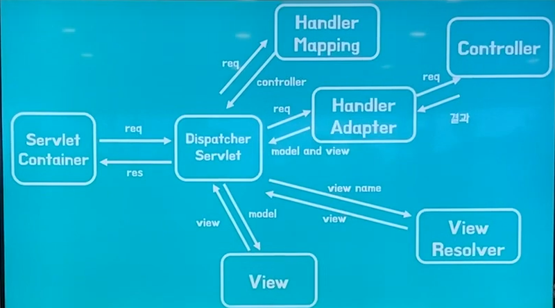
</p>

결국 개발자가 작성한 비즈니스 로직도 ServletContainer가 관리하게 되고, Spring MVC도 ServletContainer가 관리하고 있는 Servlet 한 개를 의미한다.
Spring MVC로 들어가는 모든 요청과 응답은 DispatcherServlet이 관리하고 있는 것이다.
물론 Spring Container는 Spring의 자체 Configuration에 의해 생성된다.

 - Servlet Container는 Process 하나에 배정되어 있는 것이며, 이에 따르는 요청들은 Thread 별로 처리하도록 ThreadPool에서 역할을 배정시키는 것이다. 그 중, 클라이언트가 임의의 서블릿을 실행하라고 요청했는데 만약 최초의 요청이면 init()을 실행하고, 아니라면 새로 서블릿을 만들지 않고 메소드 영역에 있는 서블릿을 참고해서 service()를 실행하는 것이다. 
 - 이렇게 개발자가 아닌 프로그램에 의해 객체들이 관리되는 것을 `IoC(Inversion of Control)`이라고 한다.

> Spring Web MVC가 없던 과거에는, URL마다 Servlet를 생성하고 Web.xml로 Servlet로 관리했다.
> URL마다 서블릿이 하나씩 필요하다 보니, 매번 서블릿 인스턴스를 만들어야 했다. 그런데 Dispatcher Servlet이 도입된 이후에는 FrontController 패턴을 활용할 수 있게 되면서 매번 서블릿 인스턴스를 만들 필요가 없어졌다.
> 또한, View를 강제로 분리하는 효과도 볼 수 있게 되었다.

<p align="center">
  
</p>


## 5. Spring Context

<p align="center">
  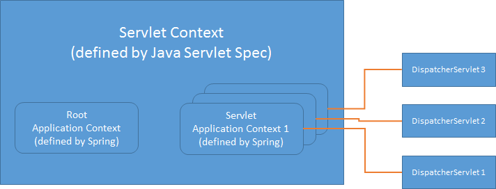
</p>

- Spring Web MVC에는 총 3가지의 Context가 존재한다. 하나는 ServletContext이다. Servlet API에서 제공하는 context로 모든 servlet이 공유하는 context이다. 
- 특히, Spring Web MVC에서는 ServletContext가 WebApplicationContext를 가지고 있다. 또 하나는 ApplicationContext로, Spring에서 만든 애플리케이션에 대한 context를 가지고 있다.
- 마지막으로, WebApplicationContext란 Spring의 ApplicationContext를 확장한 인터페이스로, 웹 애플리케이션에서 필요한 몇 가지 기능을 추가한 인터페이스다. 예를 들면 WebApplicationContext의 구현체는 getServletContext라는 메소드를 통해 ServletContext를 얻을 수 있다. 
- Spring의 DispatcherServlet은 web.xml을 통하여 WebApplicationContext를 바탕으로 자기자신을 설정한다.

<p align="center">
  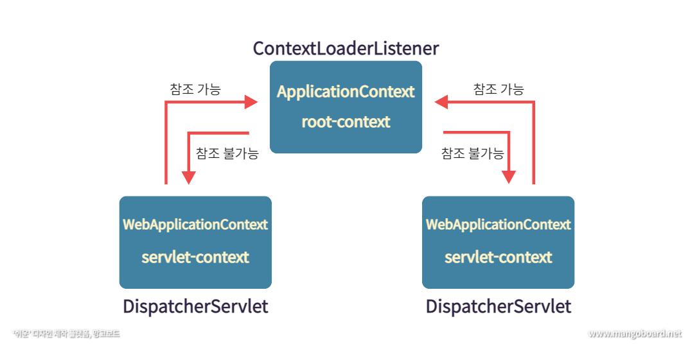
</p>

- 스프링에서 말하는 컨텍스트(context)는 스프링이 관리하는 빈들이 담겨 있는 컨테이너이다.
- Context는 계층 구조를 가질 수 있는데, 예를 들어 부모-자식 관계이거나 상속 관계일 수 있다.
- 하나의 root WebApplicationContext(또는 root-context.xml)밑에 여러 개의 child WebApplicationContext(또는 servlet-context.xml)를 가질 수 있다.
- Data Repository나 비즈니스 서비스와 같이 공통 자원은 root에 두고, DispatcherServlet 마다 자신만의 child Context를 갖도록 만들어 자신들의 Servlet에서만 사용할 빈들을 가지고 있도록 한다.

<p align="center">
  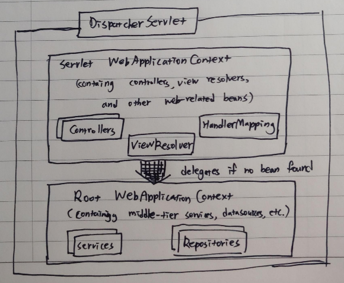
</p>

## 6. applicationContext와 webApplicationContext의 차이점

|Application context| webApplication context |
|---|------------------------|
|ApplicationContext는 독립 실행형 응용 프로그램을 만드는 데 사용됩니다.	|WebApplicationContext는 웹 애플리케이션을 만드는 데 사용됩니다.
|ApplicationContext는 WebApplicationContext 인터페이스의 부모입니다.	|WebApplicationContext는 ApplicationContext 인터페이스의 자식입니다.
|ApplicationContext의 경우 컨테이너 객체를 수동으로 생성하고 파괴해야 합니다.	|그러나 WebApplicationContext의 경우에는 컨테이너 객체를 생성하고 파괴할 필요가 없습니다. 컨테이너 개체가 자동으로 생성됩니다.
|애플리케이션에는 항상 단일 ApplicationContext가 있습니다.	|각 디스패처 서블릿에 대해 여러 WebApplicationContext가 있을 수 있습니다.
|ApplicationContext는 Spring IoC Containers를 나타내며 BeanFactory의 하위 인터페이스입니다. 	|Spring의 WebApplicationContext는 웹을 인식하는 ApplicationContext입니다. 즉, Servlet Context 정보를 가지고 있습니다.
|ApplicationContext는 web.xml에 설정된 "ContextLoaderListener" 클래스를 사용하여 인스턴스화되는 모든 중간 계층 빈(서비스, DAO)을 주입하는 데 사용됩니다.	|WebApplicationContext는 "DispatcherServlet"을 사용하여 설정한 컨트롤러, 뷰 리졸버 등 웹 관련 컴포넌트를 처리하는 데 사용됩니다.
|


- ApplicationContext(Root WebApplicationContext)
  - 최상위 컨텍스트 입니다.
  - root-context에 등록되는 빈들은 모든 컨텍스트에서 사용할 수 있습니다. (공유 가능)
  - service나 dao를 포함한, 웹 환경에 독립적인 빈들을 담아둡니다.
  - 서로 다른 servlet-context에서 공유해야 하는 빈들을 등록해놓고 사용할 수 있습니다.
  - servlet-context 내 빈들은 이용이 불가능합니다.

- WebApplicationContext
  - servlet-context에 등록되는 빈들은 해당 컨테스트에서만 사용할 수 있습니다.
  - DispatcherServlet이 직접 사용하는 컨트롤러를 포함한 웹 관련 빈을 등록하는 데 사용합니다.
  - 독자적인 컨텍스트들을 가지며, root-context 내 빈 사용이 가능합니다.

> ApplicationContext는 ContextLoaderListener 클래스에 의해 만들어지고,
WebApplicationContext는 DispatcherSerlvet 클래스에 의해 만들어집니다.
=======


**ServletContext란? :**
> 서블릿 컨텍스트(ServletContext)란 하나의 서블릿이 서블릿 컨테이너와 통신하기 위해서 사용되어지는 메서드들을 가지고 있는 클래스가 바로 ServletContext다


>>>>>>> main
